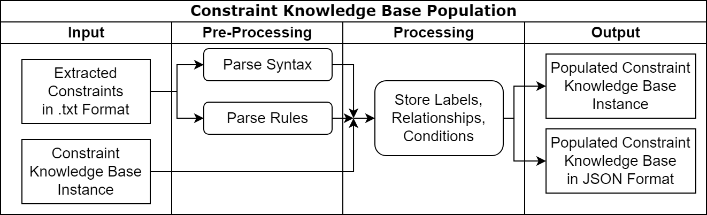

# Causation Integration in Root Cause Analysis for Business Process Violations

Thesis repository for the Bachelor's Thesis "**Causation Integration in Root Cause Analysis for Business Process Violations**".

The Dataset repository can be found [here](https://github.com/EduardoBre/nlp-bpm-data).

## Project structure:

An overview of the solution model proposed by the thesis and implemented in this repository can be seen in the following model:

Graph created using [draw.io](https://app.diagrams.net/).

This repository is mainly divided in 3 sections:

### [Pre-Processing](src/preprocessing)
The pre-processing directory entails all the implementation regarding the refactoring of the dataset to fit the purposes of the implementation in this repo.
Furthermore, all aspects related to prompt engineering are also entailed here.

### [Processing](src/processing)
The processing directory is the heart of the implementation of this thesis and entails 4 important concepts.

#### [Constraint Extraction](src/processing/constraint_mining)
Implementation of the Constraint Extraction using LLMs (gpt-3.5-turbo, gpt-4, gemini-pro).

The logic of the solution model can be seen in the following graph created with [draw.io](https://app.diagrams.net/):

#### [Constraint Knowledge Base and Population](src/processing/constraint_kb)
Implementation of the Constraint Knowledge Base as well the population of the same.

The logic of the solution model can be seen in the following graph created with [draw.io](https://app.diagrams.net/):

The implementation overview can be seen in the following UML-Class diagram created with [TUM Apollon](https://apollon.ase.in.tum.de/).

#### [Event Knowledge Graph](src/processing/knowledge_graph)
Implementation of the Event Knowledge Graph as well the population of the same.

The logic of the solution model can be seen in the following graph created with [draw.io](https://app.diagrams.net/):

The implementation overview can be seen in the following UML-Class diagram created with [TUM Apollon](https://apollon.ase.in.tum.de/).

#### [NLP-based Condition Evaluator](src/processing/knowledge_graph)
Implementation of the Event Knowledge Graph as well the population of the same.

The logic of the solution model can be seen in the following graph created with [draw.io](https://app.diagrams.net/):

The implementation overview can be seen in the following UML-Class diagram created with [TUM Apollon](https://apollon.ase.in.tum.de/).

### [Evaluation](src/evaluation)
The evaluation directory contains all the output data, as well the implementation for the evaluation of the thesis' solution model.